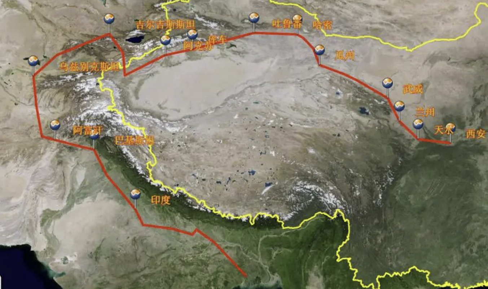

唐三藏西遊路線圖
=============

從長安（今陝西西安）出發，經秦州（今甘肅天水）—蘭州—涼州（今甘肅武威）—瓜州（今甘肅安西縣東南）—玉門關—伊吾（今新疆哈密）—高昌（今新疆吐魯番）—阿格尼國（今新疆焉耆）—屈支國（今新疆庫車）—跋逯迦國（今新疆阿克蘇）—凌山（今天山穆素爾嶺）—經大清池（今吉爾吉斯伊塞克湖）—素葉城（今吉爾吉斯托克馬克西南）—昭武九姓七國（今烏茲別克境內）—鐵門關（烏茲別克斯坦南部）—今阿富汗北境—大雪山（今興都庫什山）—迦畢試（今阿富汗首都以北）— 巴基斯坦白沙瓦城—印度，最後抵達那爛陀寺。

依據《大唐西域記》的記載能知道： 「（玄奘）經蘭州到涼州（姑藏），繼晝夜夜行，至瓜州，再經玉門關，越過五烽，渡流沙，備嘗艱苦，抵達伊吾（今哈密），至高昌國（今新疆吐魯番），受到高昌王曲文泰的禮遇。後經屈支（今新疆庫車）、凌山（耶木素爾嶺）、碎葉城、迦畢試國、赤建國（烏茲別克首都塔什幹）、颯秣建國（今撒馬爾罕城之東）、蔥嶺、鐵門。抵達貨羅國故地（今蔥嶺西、烏滸河南一帶）。南下經縛喝國（今阿富汗北境巴爾赫）、揭職國（今阿富汗加茲地方）、大雪山、梵衍那國（今阿富汗之巴米揚）、犍雙羅國（今巴基斯坦及阿富汗東部地區）、烏伏那國（巴基斯坦之斯瓦特地區），抵達迦濕彌羅國（今克什米爾）。 」

