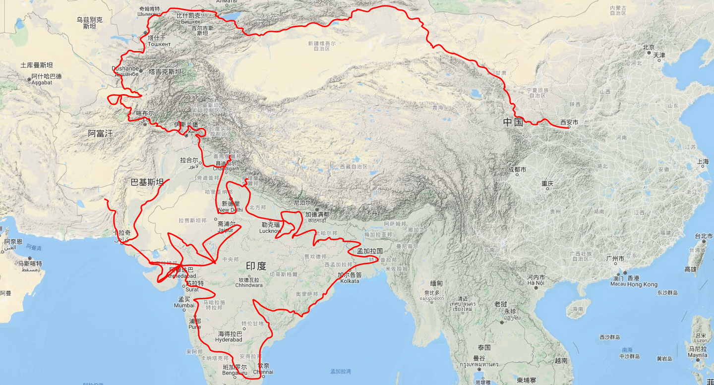

唐三藏西遊路線圖
=============

從長安（今陝西西安）出發，經秦州（今甘肅天水）—蘭州—涼州（今甘肅武威）—瓜州（今甘肅安西縣東南）—玉門關—伊吾（今新疆哈密）—高昌（今新疆吐魯番）—阿格尼國（今新疆焉耆）—屈支國（今新疆庫車）—跋逯迦國（今新疆阿克蘇）—凌山（今天山穆素爾嶺）—經大清池（今吉爾吉斯伊塞克湖）—素葉城（今吉爾吉斯托克馬克西南）—昭武九姓七國（今烏茲別克境內）—鐵門關（烏茲別克斯坦南部）—今阿富汗北境—大雪山（今興都庫什山）—迦畢試（今阿富汗首都以北）— 巴基斯坦白沙瓦城—印度，最後抵達那爛陀寺。

- 卷第一講述阿耆尼國（焉耆）、屈支國（龜茲）、跋祿迦國、赭時國、颯秣建國、弭秣賀國、劫布呾那國、喝捍國、捕喝國、伐地國、貨利習彌伽國、羯霜那國、窣堵利瑟那國，睹貨邏國、呾蜜國、赤鄂衍那國、忽露摩國、鞠和衍那國、鑊沙國、珂咄羅國、拘謎陀國、縛伽浪國、紇露悉泯健國、忽懍國、縛喝國、銳秣陀國、胡寔健國、呾剌健國、揭職國、梵衍那國、迦畢試國等三十四國。
- 卷第二，先對印度進行總的描述，更改舊譯名「身毒」和「天竺」為「印度」，這個譯名一直沿用至今。然後講述濫波國、那揭羅曷國、健馱邏國等三個國家（今阿富汗境內）。
- 卷第三敘述北印度八國：烏仗那國、缽露羅國、呾叉始羅國、僧訶捕羅國、烏剌屍國、迦濕彌羅國、半笯嗟國、遏羅闍補羅國。
- 卷第四敘述十五國，
北印度五國：磔迦國、至那僕底國、闍爛達羅國、屈露多國、設多圖盧國。
中印度十國：波理夜呾羅國、秣菟羅國、薩他泥濕伐羅國、窣祿勤那國、秣底補羅國、婆囉吸摩補羅國、瞿毗霜那國、堊醯掣呾羅國、毗羅刪那國、劫比他國。
- 卷第五敘述中印度六國：羯若鞠闍國、阿踰陀國、阿耶穆佉國、缽邏耶伽國、憍賞彌國、鞞索迦國。
- 卷第六敘述中印度四國：室羅伐悉底國、劫比羅伐窣堵國、藍摩國、拘屍那揭羅國。
- 卷第七敘述中印度五國：婆羅痆斯國、戰主國（龍藏這兩個國家列在第六卷）、吠舍釐國、弗栗恃國和尼波羅國。
- 卷第八：摩揭陀國上
- 卷第九：摩揭陀國下
- 卷第十：十七國
中印度四國：伊爛拏缽伐多國、瞻波國、羯朱嗢只羅國、奔那伐彈那國、
東印度八國：迦摩縷波國、三摩呾吒國、耽摩栗底國、羯羅拏蘇伐剌那國、烏荼國、恭御陀國、羯稜伽國、憍薩羅國、
南印度五國：案達羅國、馱那羯磔迦國、珠利耶國、達羅毗荼國、秣羅矩吒國。
- 卷第十一 二十三國：
僧伽羅國（雖非印度之國路次附出）。
南印度：恭建那補羅國、摩訶剌他國、跋祿羯占婆國、摩臘婆國、阿吒厘國、契吒國、伐臘毗國、阿難陀補羅國、蘇剌他國、瞿折羅國、鄔闍衍那國、擲枳陀國、摩醯濕伐羅補羅國。
西印度：信度國、茂羅三部盧國、缽伐多國、阿點婆翅羅國、狼揭羅國。
波剌斯國（即波斯帝國薩珊王朝，雖非印度之國路次附出舊曰波斯）
拂懍國（即東羅馬帝國）
西印度：臂多勢羅國、阿輿荼國、伐剌挐國。
- 卷第十二講述了從帕米爾，經南疆和闐、羅布泊所過二十二國：
漕矩吒國（訶達羅支）、弗栗恃薩儻那國
（睹貨邏故國）：安呾羅縛國、闊悉多國、活國、瞢揵國、阿利尼國、曷邏胡國、訖栗瑟摩國、缽利曷國、呬摩呾羅國、缽鐸創那國、淫薄健國、屈浪拿國、達摩悉鐵帝國（都城昏馱多，即今漢杜德），位於瓦罕山谷中潘扎水南岸沖積扇上）。
屍棄尼國、商彌國、朅盤陁國（都城石頭城，即今塔什庫爾干縣城）、烏鎩國（即莎車綠洲）、佉沙國、斫句迦國、瞿薩旦那國。

依據《大唐西域記》的記載能知道： 「（玄奘）經蘭州到涼州（姑藏），繼晝夜夜行，至瓜州，再經玉門關，越過五烽，渡流沙，備嘗艱苦，抵達伊吾（今哈密），至高昌國（今新疆吐魯番），受到高昌王曲文泰的禮遇。後經屈支（今新疆庫車）、凌山（耶木素爾嶺）、碎葉城、迦畢試國、赤建國（烏茲別克首都塔什幹）、颯秣建國（今撒馬爾罕城之東）、蔥嶺、鐵門。抵達貨羅國故地（今蔥嶺西、烏滸河南一帶）。南下經縛喝國（今阿富汗北境巴爾赫）、揭職國（今阿富汗加茲地方）、大雪山、梵衍那國（今阿富汗之巴米揚）、犍雙羅國（今巴基斯坦及阿富汗東部地區）、烏伏那國（巴基斯坦之斯瓦特地區），抵達迦濕彌羅國（今克什米爾）。 」

