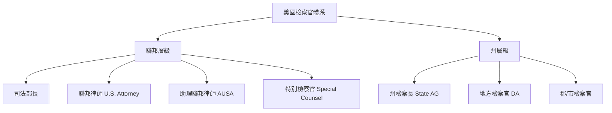

美國律師
=======

### 美國聯邦律師（United States Attorney）是什麼？
美國聯邦律師（簡稱 **U.S. Attorney**）是**聯邦政府**在各司法區（Judicial District）負責刑事起訴與民事訴訟的最高檢察官。

- **任命**：由總統提名、參議院確認，任期4年（可連任）。
- **數量**：全美有 **94位** U.S. Attorney，對應94個聯邦司法區（例如：紐約南區、加州北區等）。
- **職權範圍**：
  - **刑事**：起訴違反**聯邦法律**的案件（如毒品走私、聯邦稅務詐欺、跨州詁詐、移民犯罪、聯邦槍枝管制等）。
  - **民事**：代表聯邦政府打官司（如對抗歧視、環境法執行、醫療詐欺追討等）。
- **隸屬**：美國司法部（DOJ），直接向司法部長（Attorney General）負責。

---

### 與「州律師」（州檢察官）有什麼不同？

| 項目 | 聯邦律師 (U.S. Attorney) | 州檢察官 (State Attorney / District Attorney) |
|------|---------------------------|---------------------------------------------|
| **管轄權** | **聯邦法律**（全國統一） | **州法律**（各州不同） |
| **案件類型** | 跨州、聯邦犯罪（如FBI調查案件） | 州內犯罪（如謀殺、搶劫、家庭暴力） |
| **任命方式** | 總統任命 + 參議院確認 | **民選**（大多數州）或州長任命 |
| **隸屬單位** | 美國司法部（DOJ） | 州政府 |
| **例子** | 起訴聯邦郵件詐欺、跨州綁架 | 起訴州內強盜、酒駕致死 |

> 簡單說：**聯邦律師管「全國性」犯罪，州檢察官管「地方性」犯罪**。同一行為可能同時違反聯邦與州法（如販毒），兩邊都可起訴（雙重主權原則）。

---

### 美國律師（檢察官）主要分為哪些類別？

#### 1. **聯邦層級**
| 職稱 | 說明 |
|------|------|
| **司法部長 (Attorney General)** | 全國最高檢察官，領導DOJ |
| **副司法部長 (Deputy AG)** | 第二把手 |
| **聯邦律師 (U.S. Attorney)** | 94個司法區的「聯邦檢察長」 |
| **助理聯邦律師 (AUSA)** | 實際辦案的聯邦檢察官（最常見） |

#### 2. **州層級（各州稱呼不同）**
| 常見稱呼 | 說明 |
|---------|------|
| **地方檢察官 (District Attorney, DA)** | 最常見，負責縣/司法區（如洛杉磯郡DA） |
| **州檢察長 (Attorney General)** | 各州最高檢察官（如加州AG） |
| **郡檢察官 (County Attorney)** | 部分州用此稱呼 |
| **市檢察官 (City Attorney)** | 負責城市輕罪、違規 |

#### 3. **特殊檢察官**
| 類型 | 說明 |
|------|------|
| **獨立檢察官 (Independent Counsel)** | 歷史上用於調查高層（如水門案），現已廢除 |
| **特別檢察官 (Special Counsel)** | 由司法部長任命，調查特定重大案件（如穆勒調查俄羅斯干預） |

---

### 補充：誰可以當律師？誰可以當檢察官？
- **律師 (Attorney at Law)**：通過州律師考試（Bar Exam）即可執業。
- **檢察官**：必須是**執業律師** + **政治任命或民選**，無全國統一考試。

---

### 總結圖表

> 關鍵差別：**聯邦律師 = 總統任命 + 聯邦法；州檢察官 = 民選/州長任命 + 州法**。

### 美國聯邦律師（United States Attorneys）名單查詢來源

美國聯邦律師的名單由美國司法部（U.S. Department of Justice, DOJ）官方維護，全美共有93位正式任命的聯邦律師，負責94個聯邦司法區（關島與北馬里亞納群島共享一位）。名單會因總統任命、參議院確認或代理人更換而更新，最新的完整名單可透過以下官方管道查詢（截至2025年10月28日更新）。

#### 1. **官方主要來源：美國司法部網站**
   - **網址**：https://www.justice.gov/usao/us-attorneys-listing
   - **內容說明**：提供所有94個司法區的當前聯邦律師名單，包括姓名、司法區、聯絡資訊。標記總統任命者（*）為「The Honorable」，代理者（^）為「Mr./Ms.」。這是最權威且即時的來源。
   - **如何使用**：直接點擊司法區連結，可查看詳細資料與最新新聞。
   - **更新頻率**：定期更新，如2025年10月28日最新版本。

#### 2. **互動查詢工具：DOJ U.S. Attorneys Offices 主頁**
   - **網址**：https://www.justice.gov/usao
   - **內容說明**：包含「Find Your United States Attorney」工具，按州或司法區搜尋特定律師姓名、聯絡方式與辦公室資訊。適合單一查詢。
   - **額外功能**：可瀏覽最近新聞與執行辦公室主任（Francey Hakes）的簡介。

#### 3. **其他輔助來源**
   | 來源 | 說明 | 網址 |
   |------|------|------|
   | **美國參議院司法委員會** | 追蹤最新提名與確認（如2025年10月9日的提名人單），適合查看候選人動態。 | https://www.judiciary.senate.gov/nominations/executive |
   | **白宮提名公告** | 總統最新提名清單（如2025年10月21日的阿拉巴馬、伊利諾等區提名）。 | https://www.whitehouse.gov/presidential-actions/ |
   | **Ballotpedia** | 非官方彙整，列出截至2025年10月22日的正式、代理與臨時律師。 | https://ballotpedia.org/United_States_Attorney |
   | **Wikipedia（拜登/特朗普任命清單）** | 歷史與當前任命彙總，包含參考連結，但需交叉驗證官方來源。 | https://en.wikipedia.org/wiki/List_of_United_States_attorneys_appointed_by_Joe_Biden https://en.wikipedia.org/wiki/List_of_United_States_attorneys_appointed_by_Donald_Trump |

#### 注意事項
- **更新性**：由於任命需總統提名與參議院確認，名單可能頻繁變化。建議優先使用DOJ官方網站，以確保準確性。
- **完整性**：官方列表涵蓋所有區（如紐約南區、加州中區），無需額外工具即可下載或列印。
- **替代方式**：若需特定區資訊，可在Google搜尋「United States Attorney [州名] District」，但仍以DOJ為主。

以下用**最清楚的對比 + 實務重點**，說明「**可以在聯邦法院出庭的律師**」和「一般律師」到底有什麼不一樣。  
（以鄧洪律師為例，他就是「可在聯邦法院出庭」的類型）

---

## 一、核心差別一覽表

| 項目 | 一般律師（State Bar Attorney） | 聯邦法院出庭律師（Federal Bar Attorney） |
|------|-------------------------------|---------------------------------------|
| **執業範圍** | 只能在**州法院**（加州高等法院、上訴法院） | **州法院 + 聯邦法院**（地區法院、上訴法院、最高法院） |
| **資格要求** | 通過**州律師考試（Bar Exam）** | 州資格 **+ 額外聯邦法院認證** |
| **案件類型** | 州法案件（離婚、車禍、州內犯罪） | **聯邦法案件**（移民、聯邦毒品、專利、證券詐欺、憲法訴訟） |
| **出庭地點** | 州法院大樓（如洛杉磯高等法院） | 聯邦法院大樓（如加州中區聯邦法院） |
| **律師編號** | 州 Bar #（如鄧洪：#195796） | 州 Bar # **+ 聯邦法院編號**（如 C.D. Cal. #123456） |

---

## 二、怎麼「升級」成聯邦法院出庭律師？

| 步驟 | 說明 |
|------|------|
| 1. 取得**州律師資格** | 通過加州/紐約等州 Bar Exam |
| 2. **申請聯邦地區法院認證** | 每個聯邦司法區都要**單獨申請**（例如：加州中區、紐約南區） |
| 3. 繳交**申請表 + 費用** | 約 $200–$300 + 背景調查 |
| 4. **宣誓入會（Admission Ceremony）** | 在聯邦法官面前宣誓 |
| 5. 獲得**聯邦法院律師編號** | 才能正式在該區聯邦法院出庭 |

> **重點**：全美94個聯邦司法區，**每區都要單獨申請**！  
> 鄧洪律師就在 **加州中區聯邦法院（Central District of California）** 取得資格。

---

## 三、實際案例：什麼案子「必須」找聯邦出庭律師？

| 案件類型 | 為什麼需要聯邦律師？ |
|---------|-------------------|
| **聯邦重罪起訴**（FBI 調查） | 只能在聯邦法院審理 |
| **移民驅逐出境**（ICE 案件） | 聯邦移民法院 |
| **專利侵權** | 聯邦專利法 |
| **證券詐欺**（SEC 起訴） | 聯邦證券法 |
| **跨州詐欺**（郵件詐欺） | 聯邦法管轄 |
| **憲法訴訟**（如言論自由） | 聯邦法院專屬 |

> 一般律師若未取得聯邦資格，**連立案都不行**！

---

## 四、鄧洪律師的「聯邦出庭」實力舉例

| 案件 | 說明 |
|------|------|
| **南加大中國留學生遇害理賠** | 涉及聯邦法院管轄權（多州被告） |
| **韓亞航空舊金山空難** | 聯邦航空法 + 聯邦法院集體訴訟 |
| **聯邦重罪辯護** | 代表被告在**加州中區聯邦法院**出庭 |

→ 他不是 U.S. Attorney（檢察官），但**可以和聯邦檢察官對抗**！

---

## 五、常見誤解破解

| 誤解 | 正解 |
|------|------|
| 「聯邦出庭律師 = 聯邦檢察官」 | ❌ 錯！一個是**私人辯護**，一個是**政府起訴** |
| 「只要是律師都能打聯邦案」 | ❌ 必須**逐區申請認證** |
| 「聯邦法院比較高級」 | 對某些案件（如憲法）是**專屬管轄**，不是級別高低 |

---

## 六、想查自己律師是否能打聯邦案？3個方法

1. **問律師**：「您在哪個聯邦司法區有出庭資格？」
2. **查聯邦法院網站**  
   → 例如：[加州中區律師名單](https://www.cacd.uscourts.gov/attorneys/admissions)
3. **PACER 系統搜尋**（付費）  
   → 輸入律師姓名，看是否有聯邦案紀錄

---

## 總結：一句話記住

> **「可以在聯邦法院出庭的律師」＝ 州律師 + 聯邦法院「入場券」**  
> 能打**全國性、跨州、憲法級**的案子，一般律師做不到！

---
